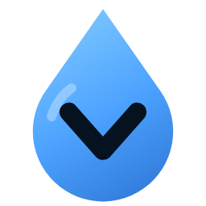

<p align="center">
  
</p>

<h1 align="center">ModDrop V</h1>

<p align="center">
  <b>Drop a GTA V mod in. It gets installed — the right way.</b><br>
  A universal mod installer for players and an Add-On packaging kit for modders.
</p>

<p align="center">
  
  
  
  
</p>

---

> **Status: early development.** ModDrop V grows out of
> [AddonWeapons Builder](https://github.com/sruckstar/AddonWeaponsBuilder) — its engine, installer and add-on weapon
> support are already here and work. Everything else below is on the way.

## 🎮 For players

Drag the mod into the window exactly as you downloaded it — folder, `.zip`, `.rar`, `.7z` or `.oiv`.
ModDrop V works out what it is and installs it through the `mods` folder, so your original game files
stay untouched and every install can be switched off or removed again.

| Mod type | Status |
|---|---|
| Add-on weapons (replace mods become real add-on weapons) | ✅ ready |
| OIV packages — installed into the `mods` folder, removable | ✅ ready |
| File replacements (textures, models, sounds, metas…) — the right place is found in the game | ✅ ready |
| Add-on vehicles and peds | planned |
| Vehicle liveries | planned |
| Scripts, plugins and their dependencies | planned |
| Clothes for the main characters, MP clothes and components | planned |
| Objects, maps and total conversions | planned |

Coming from AddonWeapons Builder? The weapons it installed show up in ModDrop V, and new weapons keep going
into the same `AddonWeapons` pack.

## 🛠️ For modders

Switch to **For Modders** to build a complete Add-On DLC (`dlc.rpf` or loose folders) from your files —
for GTA V Legacy or Enhanced.

| Add-On type | Status |
|---|---|
| Weapons | ✅ ready |
| Vehicles | planned |
| Peds | planned |
| Props | planned |
| MP clothing | planned |

A command-line tool, `mdvctl`, ships next to the app for scripting and batch builds.

## 🚀 Building from source

You need the .NET 10 SDK. CodeWalker comes in as a git submodule:

```powershell
git clone --recursive <repo-url>
dotnet run --project src/Mdv.App      # the app
.\build.ps1 -Zip                       # self-contained publish\ModDropV (+ zip)
```

## 🙏 Credits

- [CodeWalker](https://github.com/dexyfex/CodeWalker) by dexyfex — resource reading and gen9 conversion.
- **OpenIV.asi** by the OpenIV team and the **ASI Loader** by Alexander Blade — mod support for GTA V Legacy.
- **Simple Mods Loader** (`DSOUND.dll`) by NativeCoder — mod support for GTA V Enhanced.

Grand Theft Auto V is a trademark of Take-Two Interactive / Rockstar Games. This project is not affiliated
with or endorsed by them.
