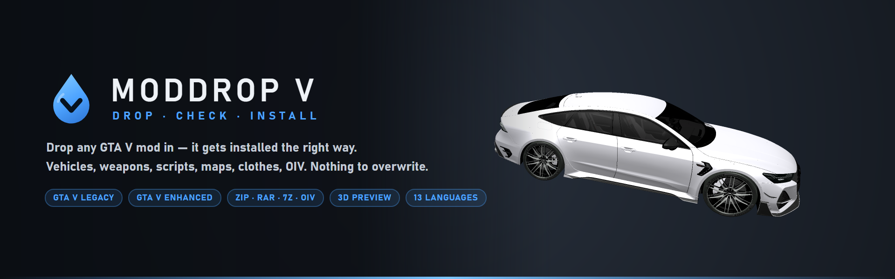
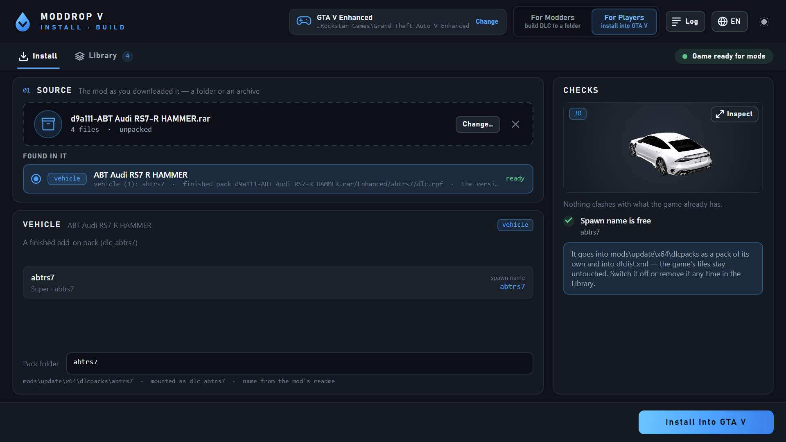
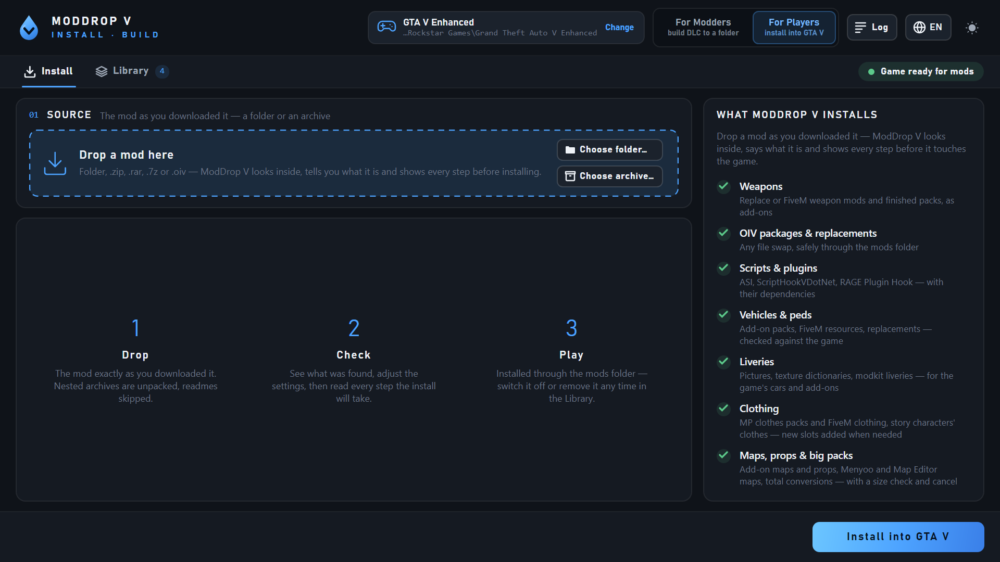
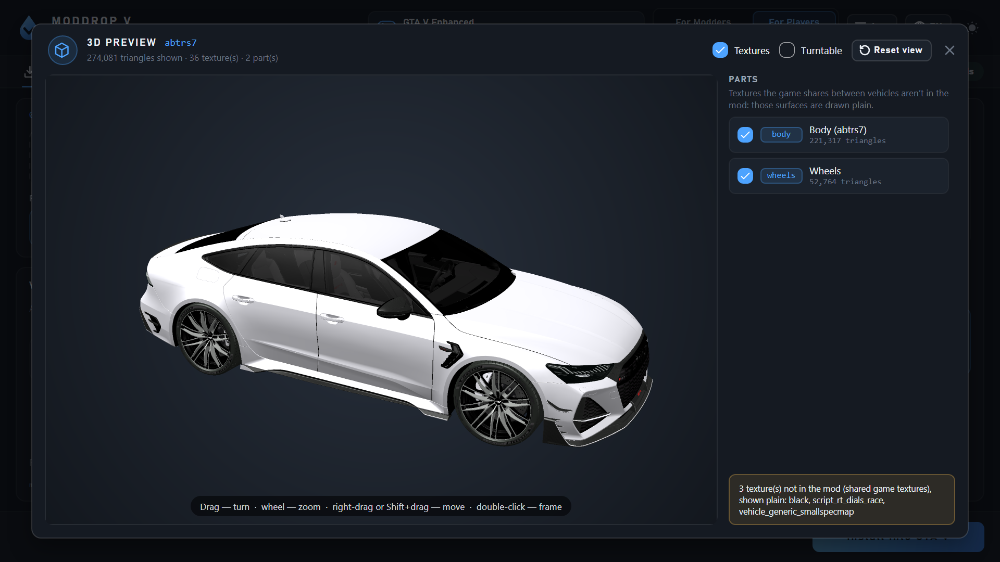
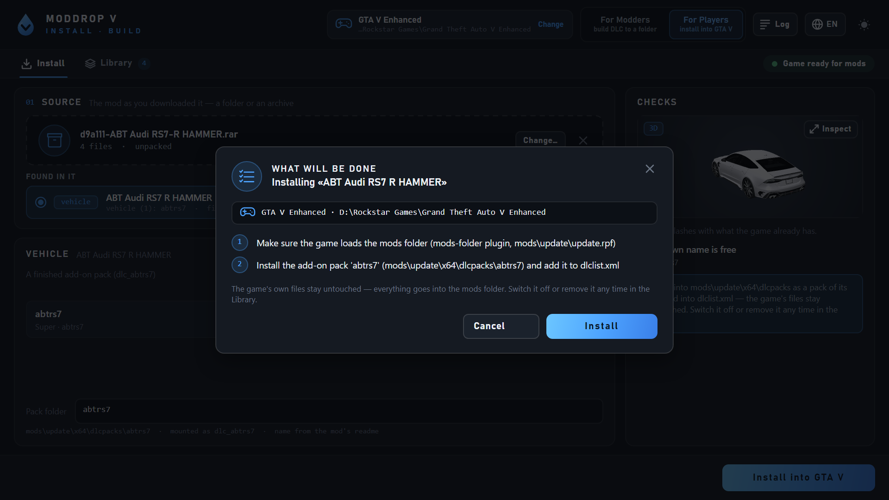
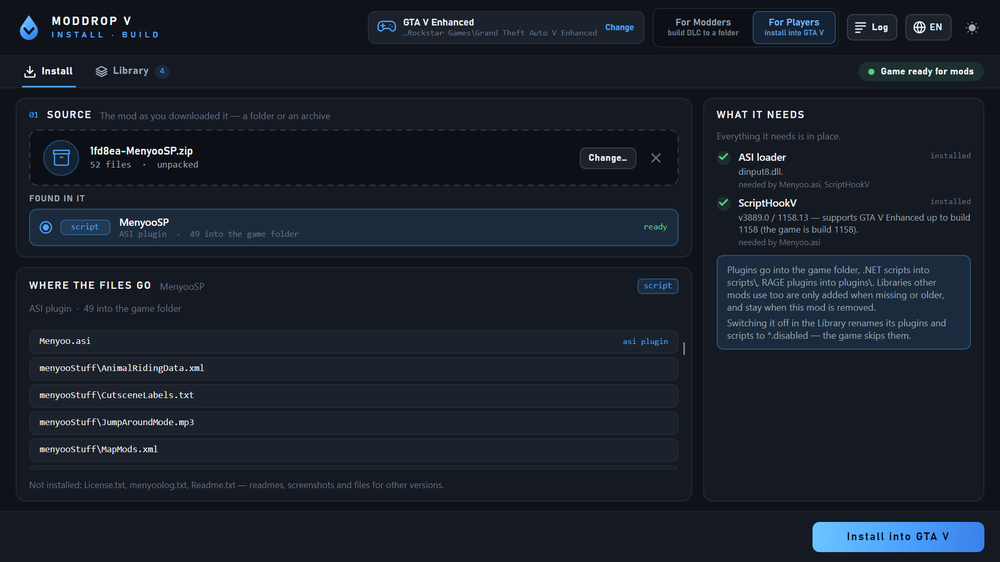
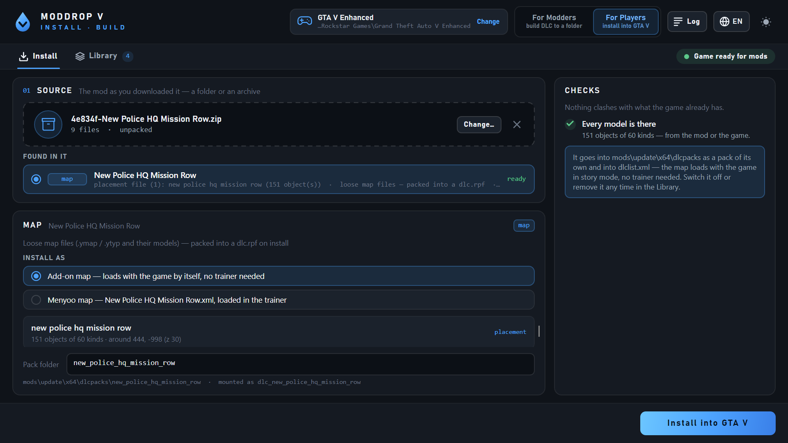
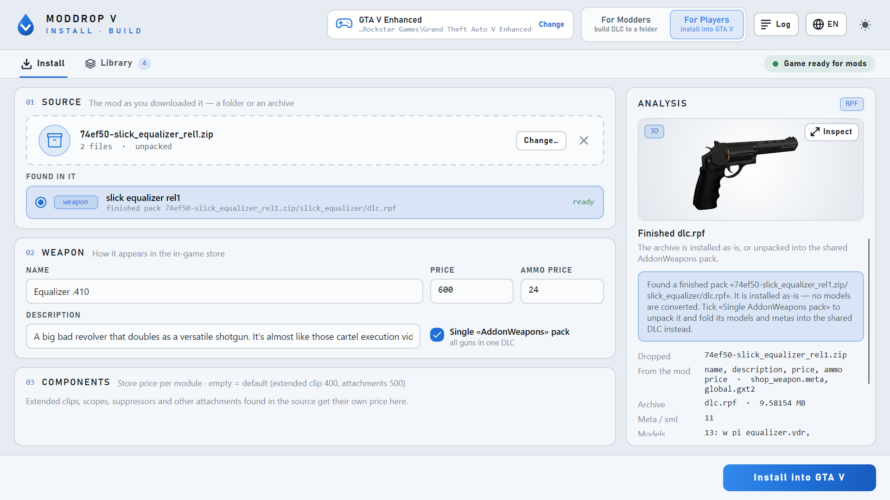
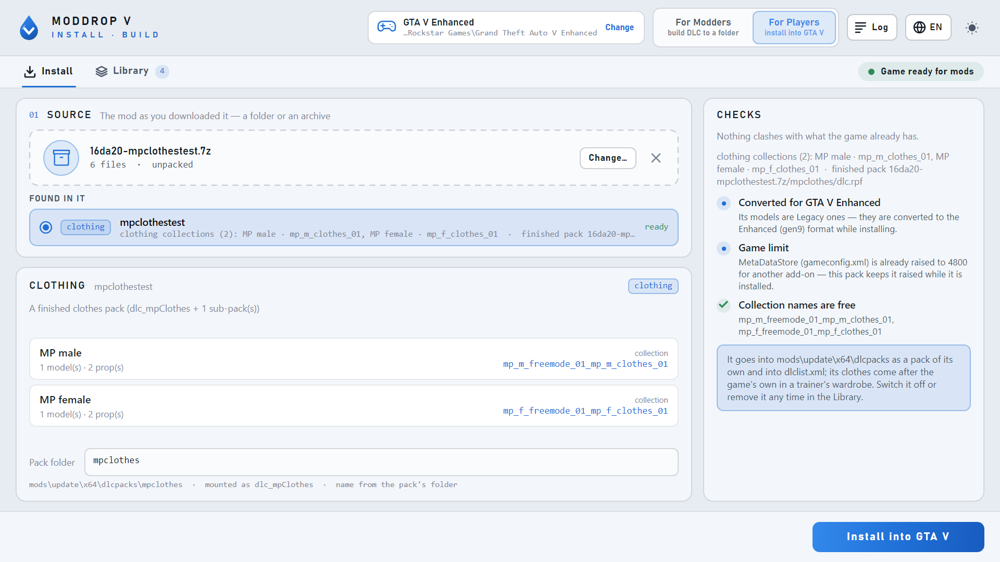
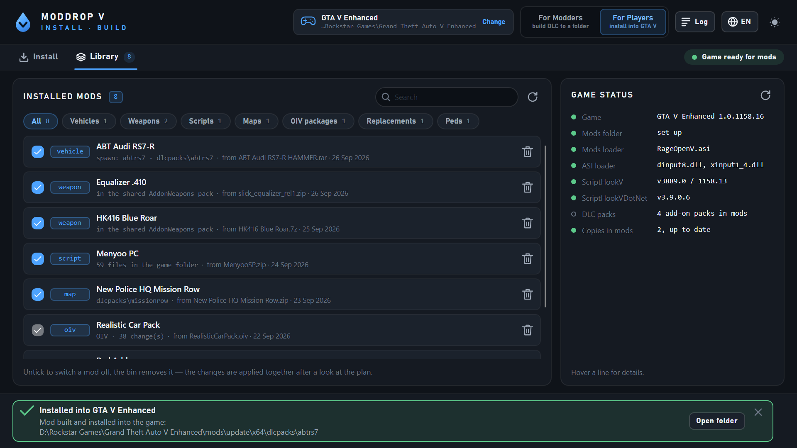

<p align="center">
  
</p>

<p align="center">
  <b>Drop a GTA V mod in. It gets installed — the right way.</b><br>
  Vehicles, weapons, scripts, maps, clothes, liveries, OIV packages and plain file swaps — straight from the archive you
  downloaded, into the <code>mods</code> folder, with every step shown first and everything removable later.
</p>

<p align="center">
  
  
  
  
  
</p>

<p align="center">
  <a href="#-how-it-works">How it works</a> •
  <a href="#-what-it-installs">What it installs</a> •
  <a href="#-for-modders">For modders</a> •
  <a href="#-getting-started">Getting started</a> •
  <a href="#-faq">FAQ</a>
</p>

<p align="center">
  
</p>

---

## Why

Installing GTA V mods by hand means reading a readme, opening OpenIV, finding the right archive, editing
`dlclist.xml`, hoping nothing gets overwritten — and repeating all of it after every game update. **ModDrop V** does
that part for you. Drag the mod into the window exactly as you downloaded it: ModDrop V looks inside, tells you what it
is, checks it against your game, shows you every step it is going to take — and only then installs it. Your original
game files are never touched: everything goes into the `mods` folder, and every mod can be switched off or removed
again from the Library.

---

## 🎮 How it works

<p align="center">
  
</p>

1. **Drop** — the folder, `.zip`, `.rar`, `.7z` or `.oiv` as you downloaded it. Nested archives are unpacked,
   readmes, screenshots and "Original / Backup" folders are skipped.
2. **Check** — see what was found and what ModDrop V checked: free spawn names, clashing modkit ids, missing
   models, what a script needs (ScriptHookV, ScriptHookVDotNet, libraries). Look at vehicles, peds and weapons in 3D.
3. **Install** — press *Install into GTA V*, read the plan, confirm. Big mods show the space they need first, every
   step as it goes, and can be cancelled at any time with everything taken back.

<table>
  <tr>
    <td width="50%"></td>
    <td width="50%"></td>
  </tr>
  <tr>
    <td align="center"><sub>Turn, zoom and inspect a car, ped or weapon before installing</sub></td>
    <td align="center"><sub>Every step is shown before anything runs</sub></td>
  </tr>
</table>

---

## 📦 What it installs

| Mod type | What ModDrop V does with it |
|---|---|
| **Add-on vehicles and peds** | Finished packs, FiveM resources (packed into a `dlc.rpf` for you), peds shared as bare models (a `peds.meta` is written for them) and replacements, with a 3D preview. Clashing spawn names and modkit ids are caught before installing; when a mod ships a Legacy and an Enhanced version, the one for your game is picked; Legacy models are converted for Enhanced. |
| **Weapons** | Replace mods become real add-on weapons (the vanilla gun stays), finished packs and FiveM weapons go in as they are. Name, price and attachments are read from the mod; 3D preview with attachments and tints. |
| **Scripts and plugins** | `.asi`, ScriptHookVDotNet, RAGE Plugin Hook / LSPDFR — each file to its place, the right version for your edition. Missing ScriptHookV, ScriptHookVDotNet or libraries are pointed out; LemonUI is added for you. |
| **Maps and props** | Finished map packs, FiveM maps, loose `.ymap` / `.ytyp` files packed as Rockstar lays its map DLCs out; Menyoo maps into `menyooStuff\Spooner`, Map Editor maps into `scripts\AutoloadMaps`. The game files and scripts a map's readme asks for go in with it. |
| **Clothes** | MP clothes packs, FiveM clothing and loose models for the MP male / female — as new slots at the end of the game's last clothing collection (the game crashes with one collection more), replacements for Michael, Franklin, Trevor and the MP peds — new slots are added to their `.ymt` when needed. |
| **Vehicle liveries** | Pictures (PNG / JPG / DDS) put into a car's own textures, whole texture dictionaries, modkit liveries — for the game's cars and installed add-ons, with a 3D preview. |
| **OIV packages** | Installed into the `mods` folder instead of the game's own archives — and removable. |
| **File replacements** | Textures, models, sounds, metas with no instructions: the right place is found in the game's archives for you. |
| **Big packs and total conversions** | The space they take is shown first, every step as it goes, cancel any time with everything taken back; a mod can be put on top of others that change the same files. |

<table>
  <tr>
    <td width="50%"></td>
    <td width="50%"></td>
  </tr>
  <tr>
    <td width="50%"></td>
    <td width="50%"></td>
  </tr>
</table>

### The Library

<p align="center">
  
</p>

- **Everything you installed, in one list.** Filter by type, search, untick a mod to switch it off, press the bin to
  remove it — the changes are applied together after a look at the plan.
- **Game status at a glance.** Game build, mods folder and its loader, ASI loader, ScriptHookV (against your game
  build), ScriptHookVDotNet, DLC packs.
- **Survives game updates.** After an update, stale archive copies in `mods` are the usual reason "everything broke".
  ModDrop V spots them and refreshes them with your mods' changes put back.
- **Coming from AddonWeapons Builder?** The weapons it installed show up here, and new weapons keep going into the
  same `AddonWeapons` pack.
- **One click to go online.** **Play GTA Online** moves every mod out of the game folder — the `mods` folder, ASI
  loaders, ScriptHookV and ScriptHookVDotNet, `.asi` plugins, scripts, ReShade, any DLL the game doesn't come with —
  into `ModDropV-Stash`, whoever installed them. Nothing is deleted or copied, so it takes a moment even for gigabytes;
  **Bring mods back** puts everything where it was.

---

## 🛠️ For modders

Switch to **For Modders** to build a complete Add-On DLC (`dlc.rpf` or loose folders) from your files — for GTA V
Legacy or Enhanced.

| Add-On type | Status |
|---|---|
| Weapons — from replace files to a finished add-on (metas, components, shop entries, text labels) | ✅ ready |
| Vehicles — from a car's models (replace files too) to a finished add-on: pick one of the game's 934 vehicles as the base and its handling, layout, cameras, class and sound are copied; `vehicles.meta`, `handling.meta`, `carvariations.meta`, a modkit with a free id and the in-game name and make are written; your own metas win | ✅ ready |
| Peds — from a ped's models (a component dictionary or a streamed folder of components, replace files too) to a finished add-on: pick one of the game's 1,100 peds as the base (animals too) and its movement, gestures, voice, personality and behaviour go into `peds.meta`; with no `.ymt` one is written from the components and their textures; your own `peds.meta` wins | ✅ ready |
| Props | coming soon |
| MP clothing | coming soon |

A command-line tool, `mdvctl.exe`, ships next to the app: `mdvctl install <game_dir> <mod>` installs any mod the way
the app does, `mdvctl status <game_dir>` shows how the game stands for mods, `mdvctl online <game_dir> on|off` puts the mods away
for GTA Online and back, `mdvctl build …` builds add-on weapons, `mdvctl build-vehicle …` add-on vehicles, `mdvctl build-ped …` add-on peds.
Run it without arguments for the full list.

---

## 🚀 Getting started

**Requirements:** Windows 10 or 11 (x64), GTA V for PC — Legacy or Enhanced (Rockstar Games Launcher, Steam or Epic
Games). Nothing else: .NET is bundled.

1. Download the latest release and unzip it anywhere (not inside the game folder).
2. Run **ModDropV.exe**. It finds your game and tells which edition it is.
3. Drop a mod into the window.

No mod setup yet? ModDrop V prepares the game on the first install: the `mods` folder and the mods loader that suits
your edition. A loader that is already there (OpenIV.asi, RageOpenV, OpenRPF…) is left as it is.
The loader it sets up is [RageOpenV](https://www.gta5-mods.com/scripts/rageopenv) (Legacy and Enhanced): its author
asks not to redistribute it, so ModDrop V downloads the latest official release from GitHub on the first install that
needs it. A `DSOUND.dll` mods loader is replaced — it fails on big archives (the game doesn't start with a 2 GB+
`update.rpf`).

**Onigiri (NaturalVision Enhanced).** When GTA V Enhanced runs Onigiri (`onigiri.asi` in the game folder), mods go
where Onigiri reads them — the `onigiri` folder, as loose files — and no `mods` folder or loader is set up:
`onigiri\common` = `update.rpf\common`, `onigiri\platform` = `update.rpf\x64` (it also stands over the base archives'
files), `onigiri\dlcpacks` = `update\x64\dlcpacks`, and the pack list is the loose `onigiri\common\data\dlclist.xml`.
A file inside an archive goes into a copy of just that archive (`vehicles.rpf`, not the whole `x64e.rpf`); files
Onigiri's own package put there come back when the mod is removed. After a game update, the game status offers to add
the game's new DLC packs to Onigiri's `dlclist.xml`.

🌐 **13 languages** — English, Français, Deutsch, Italiano, Español (España / México), Português (Brasil), Polski,
Русский, 한국어, 繁體中文, 日本語, 简体中文. ModDrop V starts in your Windows language; switch any time with the
globe button.

---

## ❓ FAQ

**Will it break my game or overwrite my files?**
No. Everything goes into the `mods` folder; the original game archives stay untouched. To undo an install, remove the
mod in the Library.

**Do I need OpenIV?**
No. ModDrop V edits the archives itself and sets up the mods loader for your edition if there is none.

**The mod I downloaded is for Legacy, but I play Enhanced.**
Models made for Legacy are converted for Enhanced while installing. When a mod ships both versions, the one for your
game is picked. (Enhanced-only models can't go into Legacy — ModDrop V tells you so before installing.)

**A game update came out and my mods stopped working.**
Open the Library: if the copies of game archives in `mods` are out of date, ModDrop V offers to refresh them, with your
mods' changes put back.

**Can I use it in GTA Online?**
Mods are for story mode — don't go online with a modded game. Before going online, press **Play GTA Online** at the
top: every mod, loader and script hook leaves the game folder, and **Bring mods back** returns them afterwards. If a
tool once edited the game's own archives directly, ModDrop V says so — verify the game files in the launcher then.

**Something went wrong — where do I look?**
Press **Log** in the top bar to see what happened during the last install. The full log file is one click away —
attach it when reporting a problem. `ModDropV.exe --diagnose` writes a report on the app and your game.

---

## 🧱 Building from source

You need the .NET 10 SDK. CodeWalker comes in as a git submodule:

```powershell
git clone --recursive <repo-url>
dotnet run --project src/Mdv.App      # the app
.\build.ps1 -Zip                       # self-contained publish\ModDropV (+ zip)
```

## 🙏 Credits

- [CodeWalker](https://github.com/dexyfex/CodeWalker) by dexyfex — resource reading and gen9 conversion.
- [BCnEncoder.NET](https://github.com/Nominom/BCnEncoder.NET) by Nominom — texture compression for liveries.
- [LemonUI](https://github.com/LemonUIbyLemon/LemonUI) by Lemon — ships with ModDrop V under its MIT licence for the scripts that need it.
- [RageOpenV](https://github.com/Chiheb-Bacha/RageOpenV) by Chiheb-Bacha (based on ClosedIV by martonp96) — mod
  support for GTA V Legacy and Enhanced; not bundled, downloaded from its official GitHub release.
- The **ASI Loader** by Alexander Blade — loads RageOpenV and other .asi plugins.
- **Heap Adjuster** (Cameron Berry) and **Packfile Limit Adjuster**, their GTA V Enhanced builds — ship with ModDrop V
  under their MIT licences and go into GTA V Enhanced together with the raised limits.
- **Weapon Limits Adjuster Enhanced** — ModDrop V's port of [WeaponLimitsAdjuster](https://github.com/alexguirre/gtav-WeaponLimitsAdjuster)
  by alexguirre (whose component-array fix comes from FiveM) to GTA V Enhanced, MIT, source in `plugins/`. It lifts the
  game's limit of 470 weapon components (about 5 above its own) and goes in with the other two.
- ScriptHookV, ScriptHookVDotNet and RAGE Plugin Hook are never bundled — ModDrop V links to their official pages.
- Mods in the screenshots: **ABT Audi RS7-R HAMMER**, **Equalizer .410** by HeySlickThatsMe, **Menyoo PC** by MAFINS,
  **New Police HQ Mission Row** by X_Jen67.

Grand Theft Auto V is a trademark of Take-Two Interactive / Rockstar Games. This project is not affiliated with or
endorsed by them.
